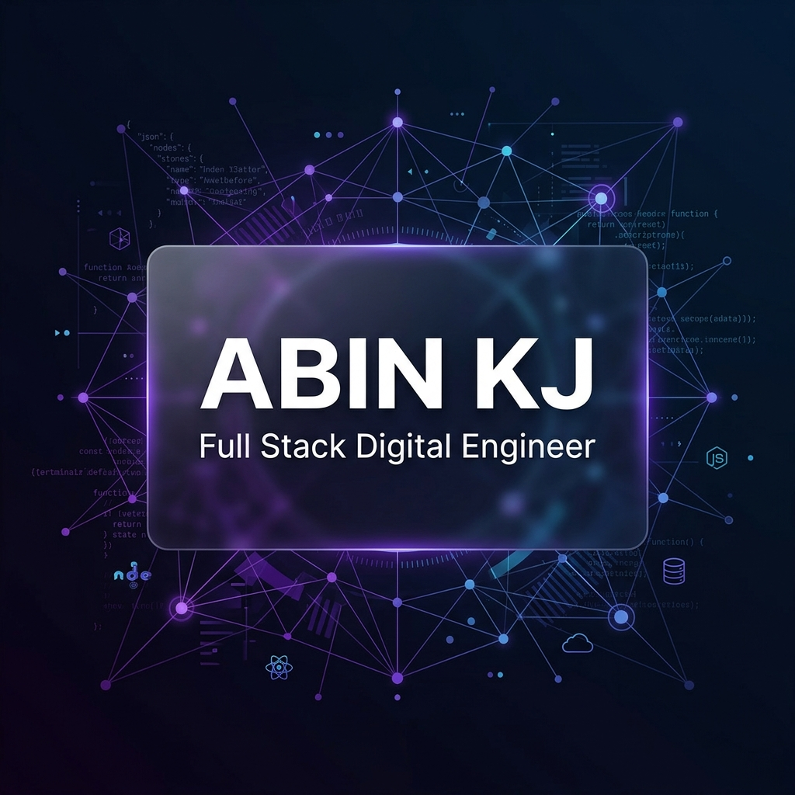

# <p align="center">✨ ABIN KJ — Full Stack Digital Engineer ✨</p>

<p align="center">
  
</p>

<p align="center">
  <a href="https://petlinkk.vercel.app/"><strong>Live Demo</strong></a> ·
  <a href="mailto:abinkich132@gmail.com"><strong>Contact Me</strong></a> ·
  <a href="public/AbinkjResume.pdf"><strong>Download Resume</strong></a>
</p>

---

## 🚀 Overview

Welcome to my elite digital ecosystem. This portfolio is not just a showcase; it's a testament to high-performance engineering, cinematic aesthetics, and seamless user experiences. Built with the latest cutting-edge technologies, it combines **React 19**, **Next.js 15**, and **Three.js** to create a truly immersive environment.

### 💎 Key Features

- 🌌 **3D Interactive Background**: Immersive canvas powered by Three.js and React Three Fiber.
- ⚡ **High-Performance Architecture**: Optimized for speed and SEO with Next.js App Router.
- 🎨 **Glassmorphism UI**: Ultra-modern, premium design system with dynamic light/dark modes.
- 🔄 **Framer Motion Orchestration**: Seamless transitions and micro-animations for every interaction.
- 📱 **Fully Responsive**: Perfectly tailored experiences for mobile, tablet, and ultra-wide screens.
- 📧 **Automated Contact System**: Direct interaction layer for potential collaborations.

---

## 🛠️ Tech Stack

<div align="center">

| Area | Technologies |
| :--- | :--- |
| **Frontend** |    |
| **3D & Animation** |   |
| **Icons & Assets** |  |
| **Deployment** |  |

</div>

---

## 🏗️ Project Structure

```bash
abin/
├── app/                # Next.js App Router Components
│   ├── components/     # High-end interactive UI components
│   ├── globals.css     # Core design tokens and global styles
│   └── page.js         # Main entry point & layout orchestration
├── public/             # Static assets (3D models, images, resume)
├── jsconfig.json       # JS configuration for path aliasing
└── package.json        # Dependencies & project scripts
```

---

## 🚦 Getting Started

### Prerequisites

- **Node.js**: `v18.x` or higher
- **NPM** or **Yarn**

### Installation

1. **Clone the repository**
   ```bash
   git clone https://github.com/hey-abin/abin.git
   ```

2. **Navigate to the directory**
   ```bash
   cd abin
   ```

3. **Install dependencies**
   ```bash
   npm install
   ```

4. **Launch the engine**
   ```bash
   npm run dev
   ```

---

## 📂 Showcased Works

### 🐾 **Petlink Adoption**
A comprehensive pet adoption and listing platform designed to connect pets with loving homes seamlessly.
*Tech: Next.js, Firebase, Tailwind CSS*

### 🎮 **Mycoco Pet Game**
A high-end 3D pet care game built with Three.js for an immersive browser-based experience.
*Tech: Three.js, React Three Fiber*

### 🍜 **Momos Delivery**
A complete food delivery solution with real-time tracking and a modern interactive UI.
*Tech: React, MongoDB, Node.js*

---

## 📬 Connectivity

Let's build something extraordinary together.

- **Email**: [abinkich132@gmail.com](mailto:abinkich132@gmail.com)
- **LinkedIn**: [Abin KJ](https://www.linkedin.com/in/abinkj2005)
- **GitHub**: [@hey-abin](https://github.com/hey-abin)

---

<p align="center">Created with ❤️ by <strong>ABIN KJ</strong></p>
